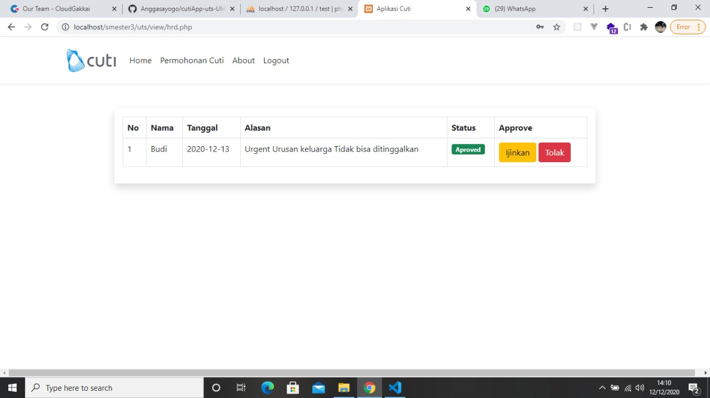

# CUTI APP WEB BASED FOR UMB 2020
Aplikasi cuti app dibuat dengan php dan boothstrap v5, app ini dibuat untuk kebutuhan tugas semata tidak direkomendasiskan untuk production!

[sini](#instalasi)

# Persyaratan
- [XAMPP](https://www.apachefriends.org/index.html)
- [VSCODE](https://code.visualstudio.com/)


# Instalasi
Clone atau download repositori ini
```
git clone https://github.com/Anggasayogo/cutiApp-uts-UMB-2020.git
```
buat database dengan nama test
```
import file sql yang ada pada folder koneksi ke db test
```
lalu untuk mencobanya kamu bisa menjalankan
```
localhost/uts
```
Lalu akan muncul seperti ini

